# PG Ledger

A small web app for running a paying-guest (PG) property — tenants, rooms, rent collection, and accounts, in one place instead of a spreadsheet.

## Screenshots

Desktop on the left, mobile on the right, for the screens that have both.

### Dashboard
<p align="center">
  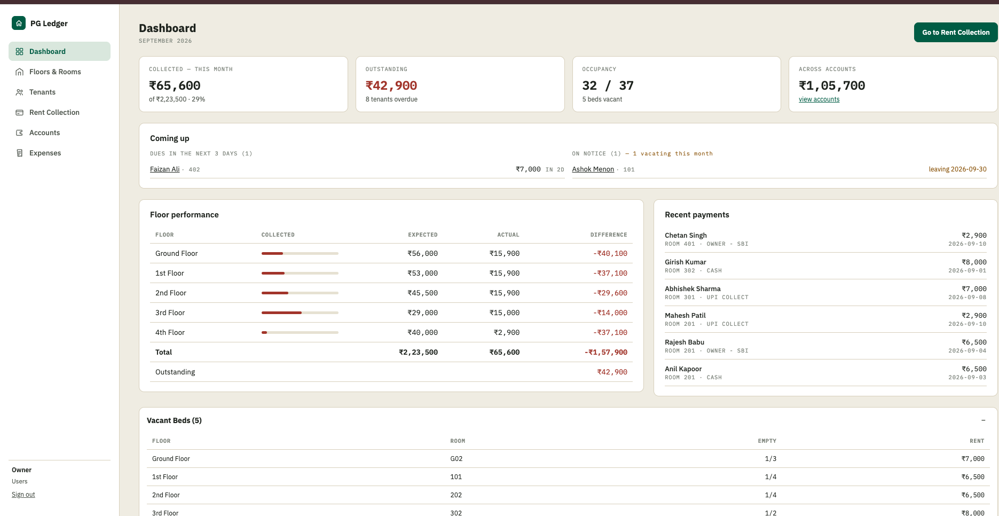
  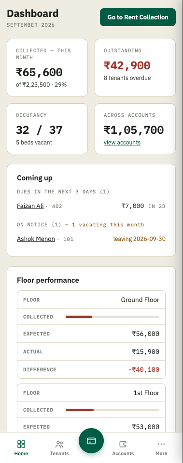
</p>

### Tenants List
<p align="center">
  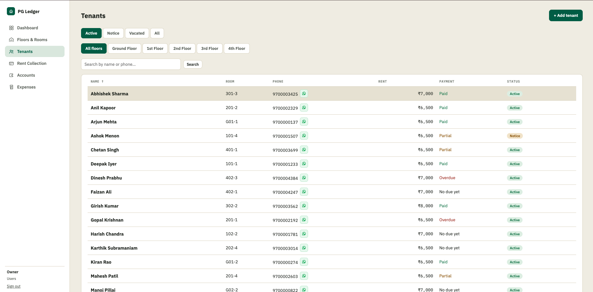
  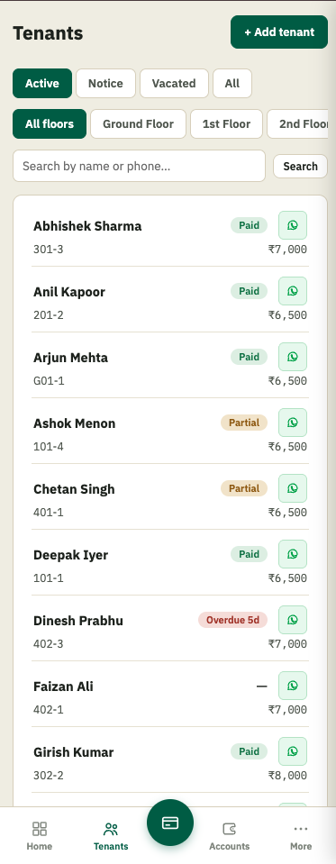
</p>

### Add Tenant
<p align="center">
  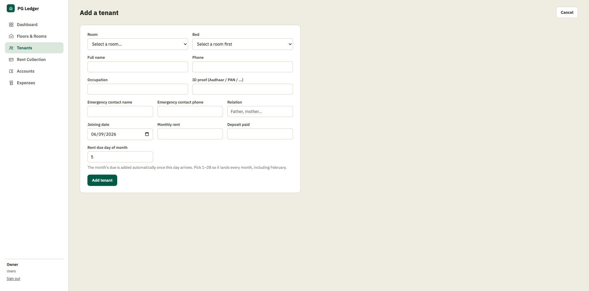
  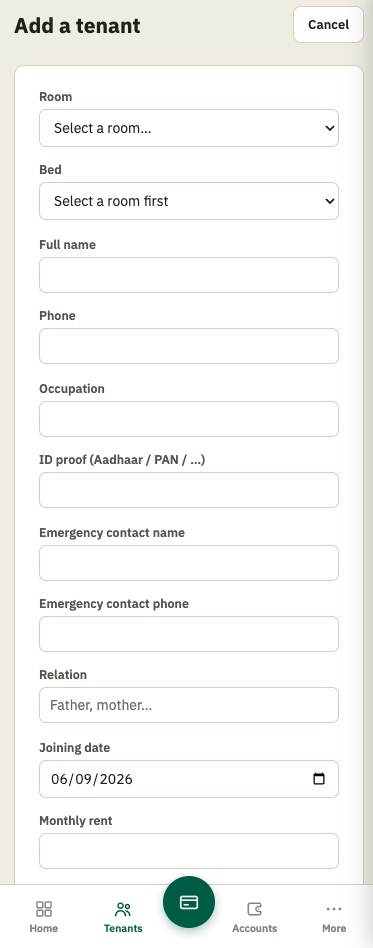
</p>

### Tenant Details
<p align="center">
  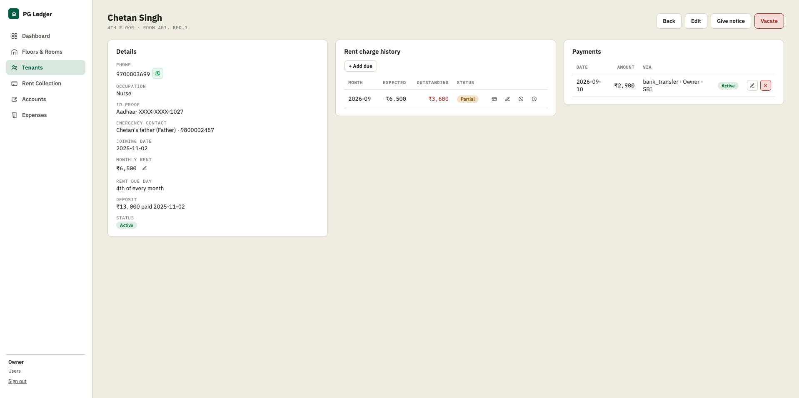
  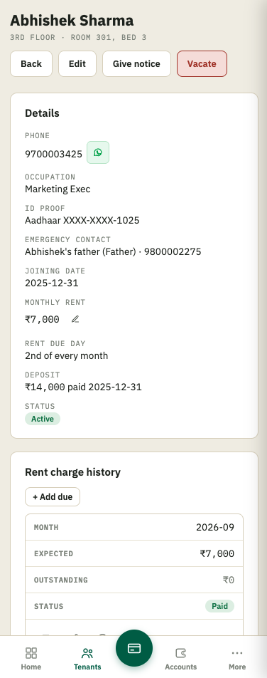
</p>

### Rent Collection
<p align="center">
  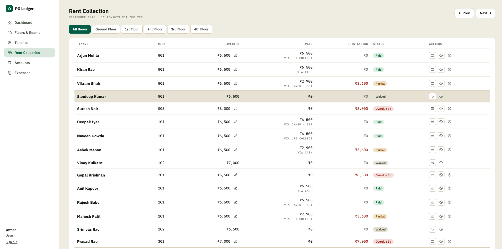
  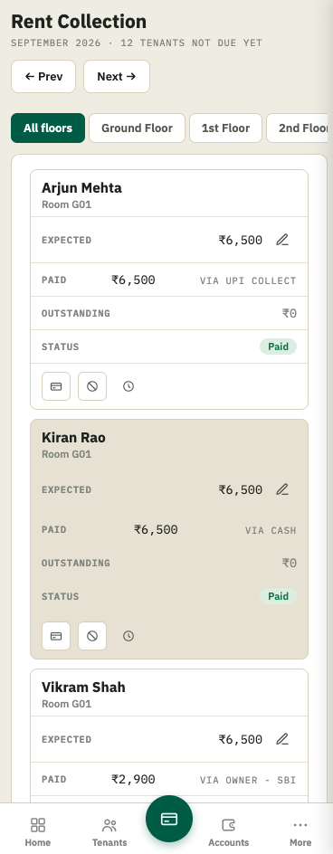
</p>

### Expenses
<p align="center">
  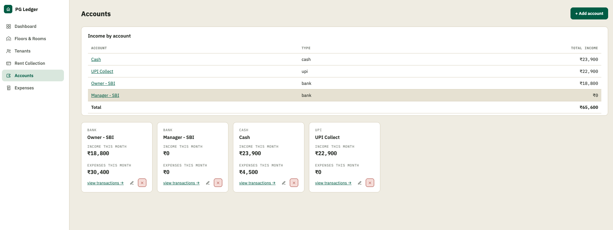
  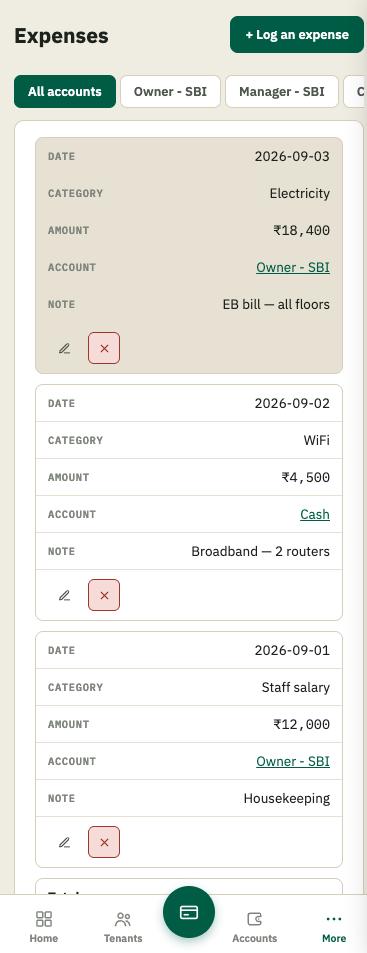
</p>

### Accounts
<p align="center">
  
  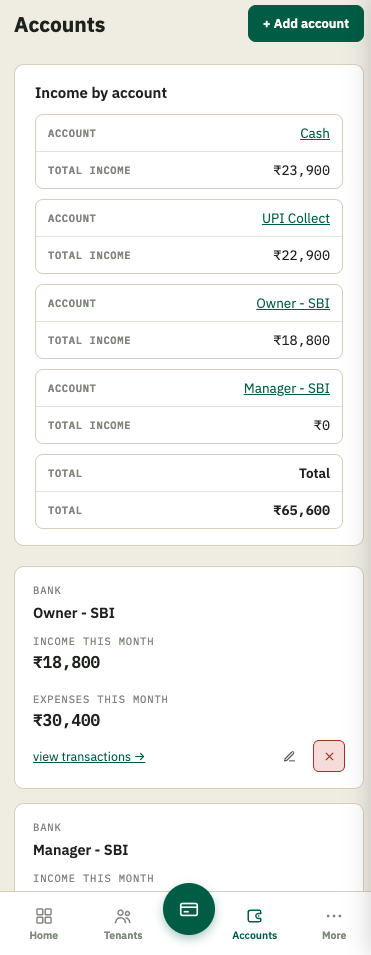
</p>

### Floors & Rooms
<p align="center">
  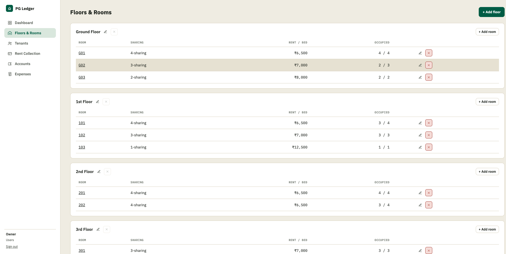
</p>

### Navigation Drawer (mobile)
<p align="center">
  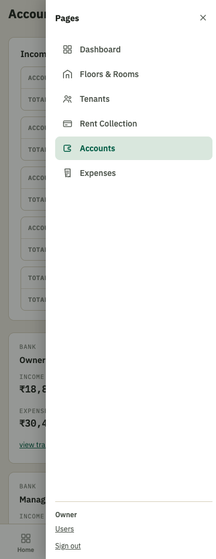
</p>

## What it does

Add tenants to rooms across floors, and each month the app works out who owes what based on their own rent due date. Rent Collection shows who's paid, who's partial, and who's overdue at a glance. Accounts tracks money in and out — cash, UPI, bank transfers — with balances that are always calculated from the transaction history rather than a number that can quietly drift out of sync. Expenses, tenant notices, deposit refunds, and a couple of logins for a manager or family member to help run things are all in there too. It's fully responsive, so day-to-day rent collection works fine from a phone.

## The one rule that shapes most of the app

Nothing money-related ever gets truly deleted once it's real. Zero out a rent due and it's marked **waived**, not removed, so it doesn't quietly reappear the next time the page loads or a new month's charges are generated. Take back a payment and it's **voided**, with a reversing entry logged against the account, rather than erased. That way there's always a paper trail for what actually happened, and account balances stay trustworthy because they're computed from that trail instead of stored as a running total.

## Running it locally

You'll need Node.js 18+ and PostgreSQL running locally.

```bash
# create a database + user (adjust to your own setup)
sudo -u postgres psql -c "CREATE USER pgledger WITH PASSWORD 'pgledger_dev_pw';"
sudo -u postgres psql -c "CREATE DATABASE pgledger OWNER pgledger;"

# point the app at it
export PGHOST=localhost PGPORT=5432 PGUSER=pgledger PGDATABASE=pgledger PGPASSWORD=pgledger_dev_pw

npm run migrate   # sets up the schema — safe to re-run any time
npm run seed      # optional: loads some demo tenants and payments to look at
npm run dev       # -> http://localhost:3000
```

Log in with `owner@pgledger.local` / `change-me-123` from the seed script. Change that password before putting any real tenant data in.

## Why it's built the way it is

This was originally planned as Next.js + Prisma + Tailwind. Partway through building it, the environment couldn't reach the npm registry, so nothing installable was available — it got rewritten with zero dependencies at first, plain Node.js shelling out to `psql` for every query. Once npm access came back, that shell-out was replaced with a real pooled `pg` connection (`src/db.js`), which is what it runs on now. Routing, HTML rendering, and auth are still hand-written rather than a framework, but the database layer is a normal Node/Postgres setup — it runs anywhere Node and Postgres run, with no build step.

## Tech stack

- **Node.js** — plain built-in `http` module, no Express/Fastify. Routing, HTML rendering, and auth are all hand-written.
- **PostgreSQL**, via the `pg` driver (a pooled connection in `src/db.js`).
- **No frontend framework.** Pages are server-rendered HTML strings, styled with plain CSS. Things like the popovers and the mobile nav drawer use a pure-CSS checkbox trick instead of JavaScript.
- **Playwright** for the end-to-end test suite (`e2e/test.mjs`).

## Testing

`e2e/test.mjs` is a Playwright script that clicks through the whole app — logging in, adding tenants, collecting rent, waiving and reinstating a due, voiding a payment, and so on — at both a desktop and a phone screen size.

```bash
npm run dev &
node e2e/test.mjs
```

## Before using this for real

- Change the seed login password (`scripts/seed.js`) before adding real tenants.
- Logins are rate-limited after repeated wrong passwords, and passwords are hashed with scrypt — see `src/auth.js`.
- SQL values are still built as strings through a hand-written escaping function (`lit()` in `src/db.js`) rather than `pg`'s own `$1`-style parameterized queries, even though the real driver is in place. It's used consistently everywhere, but switching to real parameterized queries is the next safety upgrade worth making.
